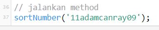
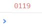
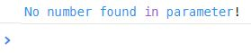
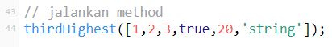
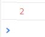
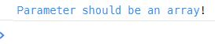
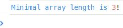
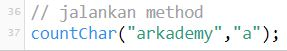
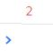
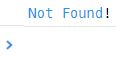

## Arkademy Batch 12 - 5
#### jawaban dari tes yang diberikan oleh Arkademy

 

### soal 1(1.js)
cara menjalakan program:
* jalankan pada console di browser anda
* atau salin code-nya lalu jalankan(run) diconsole pada website berikut: [es6console.com](https://es6console.com/)

Fungsi JSON pada REST API adalah sebagai tipe dari sebuah data yang diberikan/dikembalikan oleh REST SERVER. dengan tipe JSON maka akan memudahkan kita untuk mengakses data tersebut.

 
 

### soal 2(2.js)
cara menjalakan program:
* jalankan pada console di browser anda
* atau salin code-nya lalu jalankan(run) diconsole pada website berikut: [es6console.com](https://es6console.com/)

#### pada fungsi ini parameter pertama berupa username dan kedua berupa password

coba ubahlah **username** dan **password** pada bagian ini, dan lihat bagaimana programnya bekerja.

 

ketika menjalakan program maka akan muncul **username** dan **password** anda pada console

 

#### disetiap validasi akan mengeluarkan alert pada halaman website

#### Username

ketika **username** yang anda masukan itu panjangnya kurang atau lebih dari 6 karakter.

 

ketika **username** yang anda masukan itu bukan kombinasi dari huruf besar dan huruf kecil.

 

ketika **username** yang anda masukan itu mengandung karakter spesial atau angka.

 

#### Password

ketika **password** yang anda masukan itu kurang dari 5 atau lebih dari 10 karkter.

 

ketika **password** yang anda masukan itu tidak diawali oleh angka 7.

 

ketika **password** yang anda masukan itu tidak mengandung huruf besar, huruf kecil dan angka.

 

ketika **password** yang anda masukan itu tidak mengandung karakter spesial.

 
 

### soal 3(3.js)

cara menjalakan program:
* jalankan pada console di browser anda
* atau salin code-nya lalu jalankan(run) diconsole pada website berikut: [es6console.com](https://es6console.com/)

#### program ini bertugas untuk mencari angka pada sebuah string(jika ada angka maka akan mengeluarkan output berupa angka yang sudah diurutkan)

program ini default nya menjalankan fungsi dengan mengirim sebuah parameter berupa string **"11adamcanray09"**

 

program ini akan mengeluarkan output pada console berupa **angka** yang ada pada string dan juga **mengurutkan angka tersebut dari yang terkecil hingga angka terbesar.**

 

program ini akan mengeluarkan output pada console berupa **pesan kesalahan** jika di dalam string yang kita input itu **tidak terdapat angka didalamnya.**

 
 

### soal 4(4.js)

cara menjalakan program:
* jalankan pada console di browser anda
* atau salin code-nya lalu jalankan(run) diconsole pada website berikut: [es6console.com](https://es6console.com/)

#### program ini bertugas untuk menentukan bilangan terbesar ke-3(berupa angka) pada array

program ini default nya menjalankan fungsi dengan mengirim sebuah parameter berupa array **[1,2,3,true,20,'string']**

 

ketika dijalankan di console akan menampilkan angka "2", karena dari array **[1,2,3,true,20,'string']** yang terbesar ke-3 adalah angka "2", method akan mengabaikan tipe data lain selain **number**

 

ketika anda memasukan paramter yang bukan array(string, char, dll), contoh: **thirdHighest('string');** maka program akan menghasilkan ini pada console

 

ketika anda memasukan array yang panjangnya kurang dari 3, contoh: **thirdHighest([1,2]);** maka program akan menghasilkan ini pada console

 
 

### soal 5(5.js)

cara menjalakan program:
* jalankan pada console di browser anda
* atau salin code-nya lalu jalankan(run) diconsole pada website berikut: [es6console.com](https://es6console.com/)

#### program ini bertugas untuk mencari ada berapa character(parameter kedua) didalam sebuah string(parameter pertama)

program ini default nya menjalankan fungsi **countChar("arkademy","a");** dengan mengirim 2 buah, parameter pertama berupa **string** dan parameter kedua berupa **char**

 

program ini default nya akan mengeluarkan **"2"** pada console, angka 2 adalah banyak nya karakter yang ditemukan pada sebuah string. contoh: terdapat 2 karakter **"a"** pada string **"arkademy"**

 

program ini akan mengeluarkan "Not Found!" pada console ketika tidak ada karakter **X** pada sebuah string. contoh: tidak terdapat karaker **"z"** pada string **"arkademy"**

