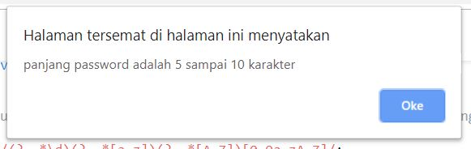

## Arkademy Batch 12 - 5
#### jawaban dari tes yang diberikan oleh Arkademy

 

### soal 1(1.js)

 

cara menjalakan program:
* jalankan pada console di browser anda
* atau salin code-nya lalu jalankan(run) diconsole pada website berikut: [es6console.com](https://es6console.com/)

 

Fungsi JSON pada REST API adalah sebagai tipe dari sebuah data yang diberikan/dikembalikan oleh REST SERVER. dengan tipe JSON maka akan memudahkan kita untuk mengakses data tersebut.

 
 

### soal 2(2.js)

 

cara menjalakan program:
* jalankan pada console di browser anda
* atau salin code-nya lalu jalankan(run) diconsole pada website berikut: [es6console.com](https://es6console.com/)

 

#### pada fungsi ini parameter pertama berupa username dan kedua berupa password

 

coba ubahlah **username** dan **password** pada bagian ini, dan lihat bagaimana programnya bekerja.

 

ketika menjalakan program maka akan muncul **username** dan **password** anda pada console

 

 

#### disetiap validasi akan mengeluarkan alert pada halaman website

 

#### Username

 

ketika **username** yang anda masukan itu panjangnya kurang atau lebih dari 6 karakter.

 

 

ketika **username** yang anda masukan itu bukan kombinasi dari huruf besar dan huruf kecil.

 

 

ketika **username** yang anda masukan itu mengandung karakter spesial atau angka.

 

 

#### Password

 

ketika **password** yang anda masukan itu kurang dari 5 atau lebih dari 10 karkter.

 

 

ketika **password** yang anda masukan itu tidak diawali oleh angka 7.

 

 

ketika **password** yang anda masukan itu tidak mengandung huruf besar, huruf kecil dan angka.

 

 

ketika **password** yang anda masukan itu tidak mengandung karakter spesial.

 

 